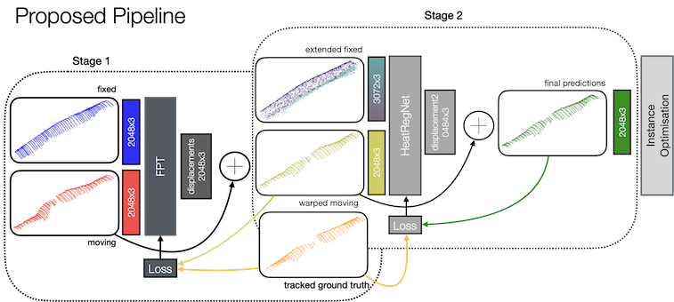

# HeatReg

This repository contains the code for the paper "3D Freehand Ultrasound Reconstruction by Reference-Based Point Cloud Registration". The paper is currently under review for International Journal of Computer Assisted Radiology and Surgery (IJCARS).




## Inference Demo

We provide an Inference Demo at [Huggingface](https://huggingface.co/spaces/chrgrbrmr/HeatRegDemo). This demo is built directly from this repo, so you can install the streamlit yourself. We further provide code to train your own networks in `train.py`. 

For installation, please install the following dependencies:

* pytorch
* pytorch3d
* trimesh
* [pointops](https://github.com/POSTECH-CVLab/point-transformer/tree/master/lib/pointops)

## Citation

This paper is currently under review.
If this work is useful to you, please cite [previously published paper](https://link.springer.com/chapter/10.1007/978-3-658-44037-4_14).
```
@inproceedings{hansen2024displacement,
  title={Displacement Representation for Conditional Point Cloud Registration: HeatReg Applied to 2D/3D Freehand Ultrasound Reconstruction},
  author={Hansen, Lasse and Lichtenstein, J{\"u}rgen and Heinrich, Mattias P},
  booktitle={BVM Workshop},
  pages={39--45},
  year={2024},
  organization={Springer}
}
```
